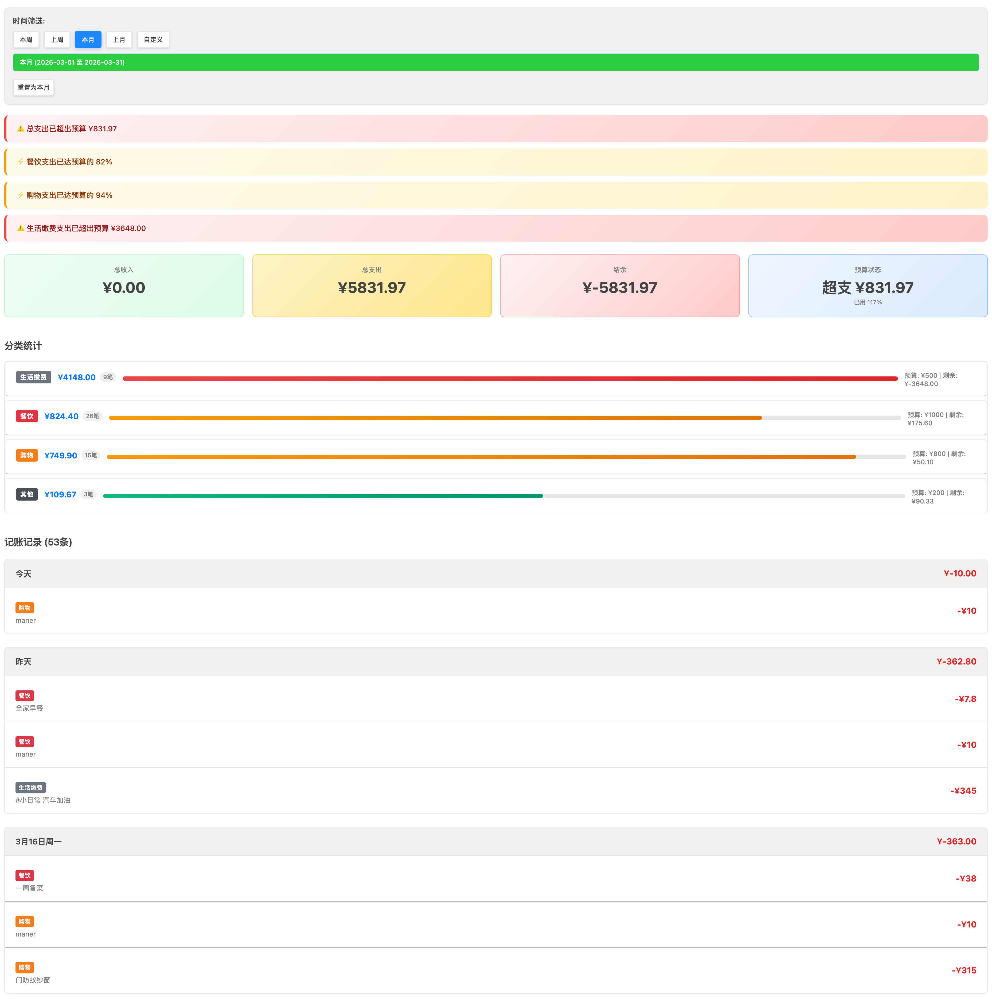
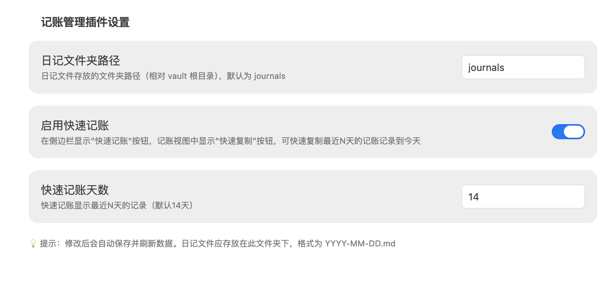
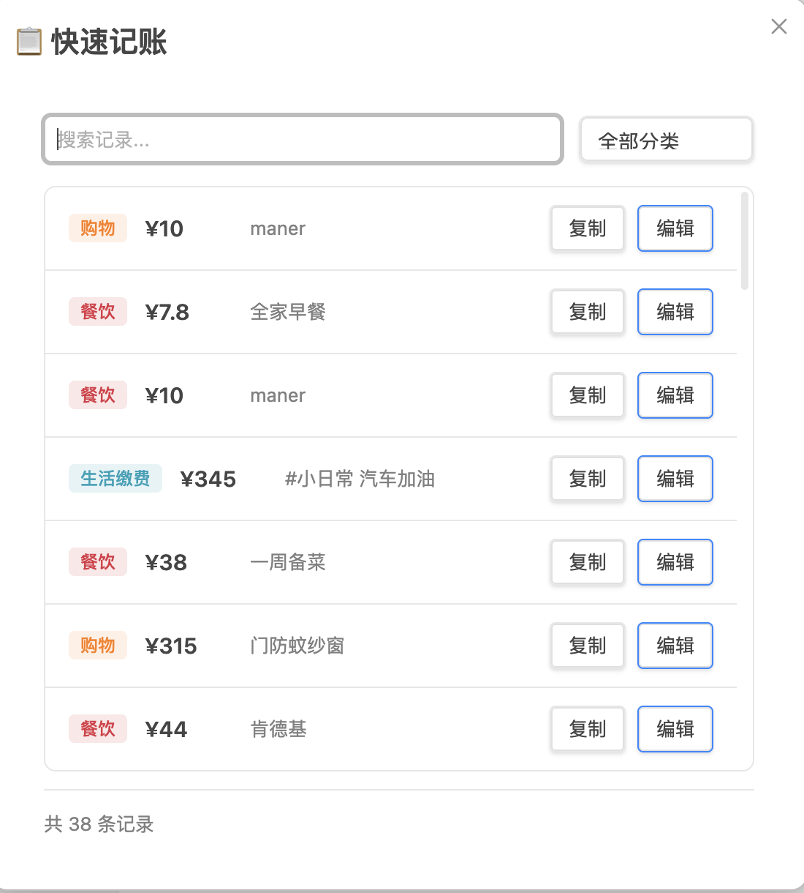
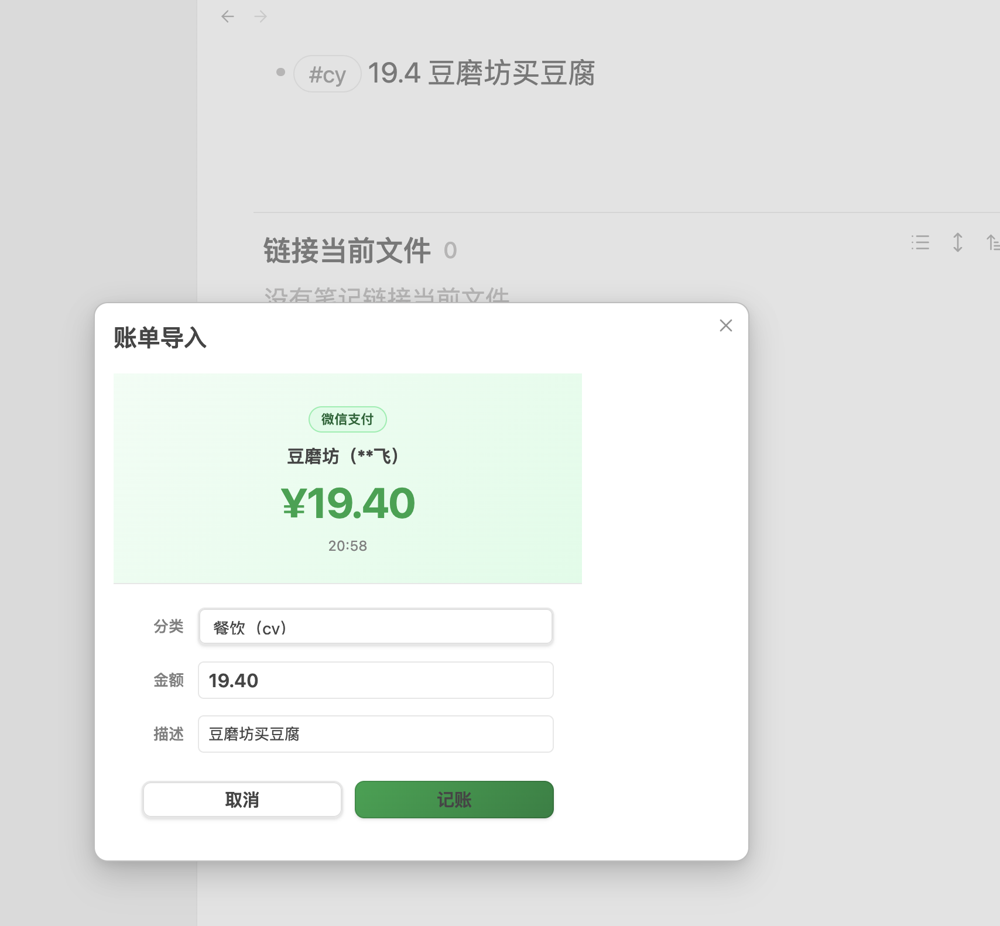

# Obsidian 记账管理插件

基于 Obsidian 日记文件的智能记账管理插件，能够自动识别和统计日记中的记账记录，支持截图账单一键导入。



## 功能特点

| 功能 | 说明 |
|------|------|
| 🔍 自动识别 | 从日记文件中自动解析记账记录 |
| 📊 统计分析 | 收支统计、分类统计、时间范围查询 |
| 🏷️ 分类管理 | 自定义关键词与分类映射 |
| 📅 时间筛选 | 按日期范围查看记账记录 |
| 💰 收支管理 | 区分收入和支出，计算结余 |
| 📋 快速记账 | 一键复制历史记录到今天 |
| 🧾 截图账单导入 | OCR 文字写入 bill.md，自动解析记账 |
| 📄 导出功能 | 支持导出 PDF 和 Markdown |

## 安装方法

### 方式一：从 GitHub Release 安装（推荐）

1. 前往 [Releases](../../releases) 页面下载最新版本
2. 下载以下文件：`main.js`、`manifest.json`、`styles.css`、`config.json`
3. 在 Obsidian 库中创建插件目录：`.obsidian/plugins/obsidian-accounting/`
4. 将下载的文件复制到该目录
5. 重启 Obsidian，在设置中启用「记账管理」插件

### 方式二：手动安装

```bash
cd /path/to/your/vault/.obsidian/plugins
git clone https://github.com/你的用户名/obsidian-accounting.git
cd obsidian-accounting
npm install && npm run build
```

## 快速开始

### 第一步：配置日记文件夹

打开设置 → **第三方插件** → **记账管理插件**，在「日记文件夹路径」填写日记文件夹（默认 `journals`）。



### 第二步：在日记中记账

在 `journals/2024-01-10.md` 中写入：

```markdown
- #cy 买豆腐 15.5
- #cy 麻辣烫 45
- #gw 超市购物 128
- #sr 工资 8500
```

### 第三步：查看统计

点击左侧工具栏计算器图标打开记账视图。

## 记账格式

### 基本格式

```
#关键词 描述 金额
```

### 格式规则

- ✅ 描述在前、金额在后（推荐）
- ✅ 金额也可以在前
- ✅ 支持货币符号（¥、元、块），自动忽略
- ✅ 一行多个数字时，**第一个数字**识别为金额

### 默认关键词

| 关键词 | 分类 | 说明 |
|--------|------|------|
| `cy` | 餐饮 | 日常饮食 |
| `gw` | 购物 | 网购、实体店 |
| `dk` | 贷款 | 房贷、车贷 |
| `jf` | 生活缴费 | 水电气网 |
| `qt` | 其他 | 未分类支出 |
| `sr` | 收入 ⭐ | **特殊关键词**，标识收入 |

## 快速记账

快速记账帮你一键复制历史记录到今天，适合固定消费项目。

### 入口

| 入口 | 说明 |
|------|------|
| 侧边栏图标 | 点击 📋 图标 |
| 命令面板 | `Cmd/Ctrl + P` → 「快速记账」 |
| Advanced URI | `obsidian://advanced-uri?vault=库名&commandid=obsidian-accounting:quick-copy` |

### 使用流程

1. 打开弹窗，显示最近 14 天记录（自动去重）
2. 搜索或按分类筛选
3. 点击「复制」直接写入今天，或「编辑」修改后写入
4. 自动跳转到今天的日记



### 手机端：背面轻点触发

1. 安装社区插件 **Obsidian Advanced URI**
2. 新建快捷指令，打开 URL：`obsidian://advanced-uri?vault=库名&commandid=obsidian-accounting:quick-copy`
3. **设置 → 辅助功能 → 触控 → 背面轻点**，选择该快捷指令

## 截图账单导入

> 用微信/建行 App 截图 → 快捷指令 OCR 识别 → 写入 bill.md → 执行命令自动记账

### 工作流程

```
支付截图
  ↓ 快捷指令（OCR）
journals/bill.md
  ↓ 命令「从账单导入记账」
自动解析 → 弹出确认框 → 写入今日日记 → 删除 bill.md
```

### bill.md 格式

支持多条记录，用 `###` 分隔，插件只解析**最后一段**：

```
20:58
5G
豆磨坊（**飞）
·19.40
完成
###
12:42
Manner
使用建设银行储蓄卡（0511）支付
·10.00
完成
```

### 支持的截图类型

| 类型 | 识别特征 |
|------|---------|
| 💚 微信支付完成页 | 含「完成」/ 「返回商家」/ 「支付成功」 |
| 💚 微信支付账单页 | 含「我的账单」+「支付服务」 |
| 🟡 建设银行动账提醒 | 含「动账提醒」或「变动提醒」|
| 🔵 支付宝 | 开发中 |

### 商户自动分类配置

打开设置 → **账单导入 - 商户自动分类**，每行一条：

```
商户关键字=分类关键词=描述
```

示例：

```
豆磨坊=cy=买豆腐
麦当劳=cy=麦当劳
盒马=gw=买菜
物业=jf=物业费
```

- **商户关键字**：OCR 商户名中包含该字即命中（无需完整匹配）
- **描述**：可省略，省略时弹框描述框留空

> 💡 先不配置映射执行一次导入，从弹框「商户」行看到 OCR 实际输出的文字，再以该文字作为 key。

### 触发命令

| 方式 | 操作 |
|------|------|
| 命令面板 | `Cmd/Ctrl + P` → 「从账单导入记账」 |
| Advanced URI | `obsidian://advanced-uri?vault=库名&commandid=obsidian-accounting:bill-import` |



## 命令列表

通过 `Cmd/Ctrl + P` 打开命令面板：

| 命令 | 命令 ID | 说明 |
|------|---------|------|
| 打开每日记账 | `open-accounting` | 打开记账视图 |
| 刷新记账数据 | `refresh-accounting` | 重新扫描日记文件 |
| 新建记账 | `quick-entry` | 打开新建记账弹窗 |
| 快速记账 | `quick-copy` | 打开快速记账弹窗 |
| 从账单导入记账 | `bill-import` | 解析 bill.md 并弹出确认框 |
| 导出账单 PDF | `export-pdf` | 导出当前视图为 PDF |
| 导出账单 Markdown | `export-markdown` | 导出当前视图为 MD |

> Advanced URI 格式：`obsidian://advanced-uri?vault=库名&commandid=obsidian-accounting:命令ID`

## 导出功能

### 导出 PDF

在记账视图点击「导出 PDF」，选择时间范围后导出，包含统计概览、分类汇总、详细记录。

### 导出 Markdown

点击「导出 MD」，生成 Markdown 格式账单报告。

## 常见问题

**Q: 看不到记账记录？**  
检查日记文件是否在配置的文件夹下、文件名是否为 `YYYY-MM-DD.md`、记账格式是否正确。

**Q: 如何添加新分类？**  
点击记账视图中的「配置分类」按钮添加。

**Q: 数据存储在哪里？**  
所有数据存储在 Obsidian 笔记中（日记文件 + config.json），完全本地。

**Q: bill.md 被误删怎么办？**  
只有点击「记账」按钮确认、或解析失败时才会删除。如有疑问可在 Obsidian 开发者控制台（`Cmd+Option+I`）搜索 `[bill-import]` 查看日志。

**Q: OCR 识别的商户名和实际不符？**  
以弹框中显示的文字为准配置商户关键字，OCR 可能存在误识别（如腐→磨）。

## 开发

```bash
npm run dev      # 开发模式
npm run build    # 构建
npm run deploy   # 部署到本地 vault
npm run release  # 发布到 GitHub
```

## License

MIT

---

## ☕ 请作者喝杯咖啡

如果这个插件帮助了你，欢迎扫码打赏，感谢支持！

<div align="center">
  
  <p><sub>微信扫码打赏</sub></p>
</div>

---

💡 **提示**：记账最难的不是方法，而是坚持。把记账融入日记，让记录消费成为写日记的自然延伸。
