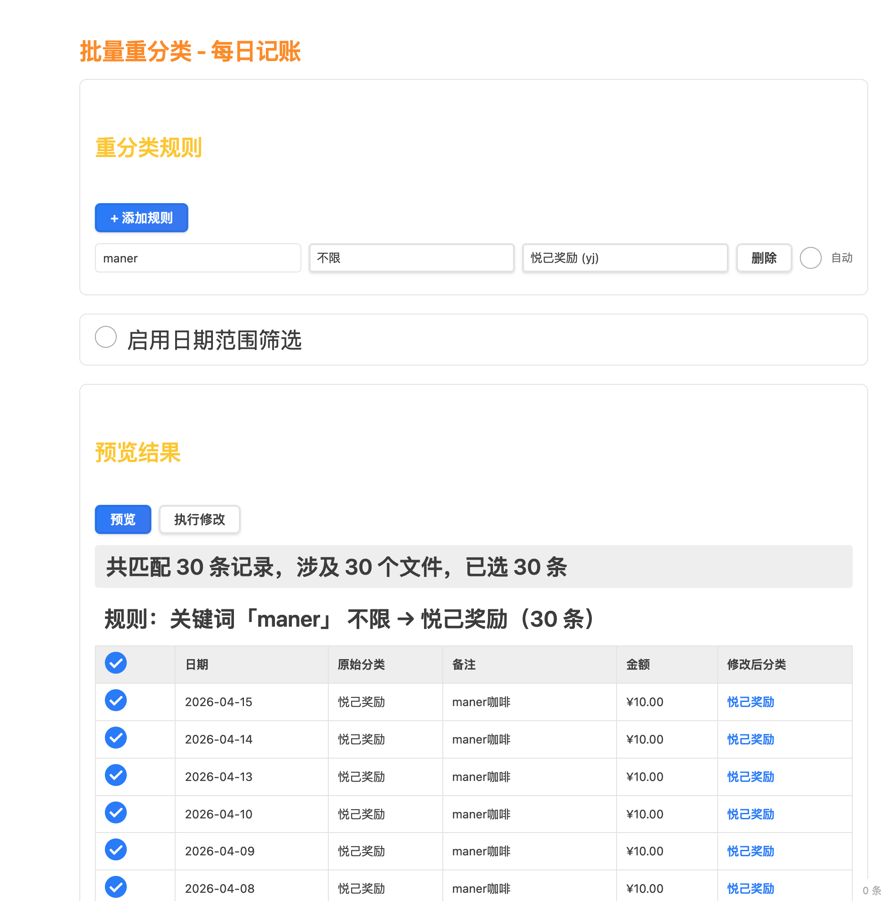

# Coin Memo — Obsidian Expense Tracker

A daily expense tracking plugin for Obsidian that automatically recognizes and tallies accounting records from your daily notes. Supports one-tap bill import via screenshot OCR.


## Features

| Feature | Description |
|---------|-------------|
| 🔍 Auto-detection | Parses expense records from daily notes automatically |
| 📊 Statistics | Income/expense summaries, category breakdowns, date-range queries |
| 🏷️ Category management | Custom keyword-to-category mapping |
| 📅 Date filter | View records by date range |
| 💰 Income & expenses | Track income and spending separately, calculate balance |
| 📋 Quick copy | Copy a past record to today with one tap |
| 🧾 Bill screenshot import | OCR text written to bill.md, auto-parsed into records |
| 📄 Export | Export to PDF or Markdown |
| 🔄 Batch reclassify | Bulk-correct categories by note keyword, with auto-run support |

## Installation

### Option 1: From Obsidian Community Plugins (Recommended)

Open Obsidian Settings → Community Plugins → Browse, and search for **Coin Memo** or **fengshuzi** to install directly.


### Option 2: From GitHub Release (recommended)

1. Go to the [Releases](../../releases) page and download the latest version.
2. Download `main.js`, `manifest.json`, `styles.css`, and `config.json`.
3. Create the plugin folder in your vault: `.obsidian/plugins/coin-memo/`.
4. Copy the downloaded files into that folder.
5. Restart Obsidian and enable **Coin Memo** in Settings → Community plugins.

### Option 3: Build from source

```bash
cd /path/to/your/vault/.obsidian/plugins
git clone https://github.com/fengshuzi/coin-memo.git
cd coin-memo
npm install && npm run build
```

## Quick Start

### Step 1: Configure the journal folder

Open Settings → **Community plugins** → **Coin Memo**, and set the journal folder path (default: `journals`).


### Step 2: Add records in your daily note

In `journals/2024-01-10.md`:

```markdown
- #cy Tofu 15.5
- #cy Spicy hotpot 45
- #gw Supermarket 128
- #sr Salary 8500
```

### Step 3: View statistics

Click the calculator icon in the left sidebar to open the expense tracker view.

## Record Format

### Basic syntax

```
#keyword description amount
```

### Format rules

- ✅ Description first, amount last (recommended)
- ✅ Amount can also come first
- ✅ Currency symbols (¥, 元, 块) are ignored automatically
- ✅ When a line contains multiple numbers, the **first number** is used as the amount

### Default keywords

| Keyword | Category | Note |
|---------|----------|------|
| `cy` | Dining | Food & drinks |
| `gw` | Shopping | Online & in-store |
| `dk` | Loans | Mortgage, auto loans |
| `jf` | Utilities | Water, electricity, gas, internet |
| `qt` | Other | Uncategorized expenses |
| `sr` | Income ⭐ | **Special keyword** — marks income |

## Quick Copy

Quick Copy lets you duplicate a past record to today — handy for recurring expenses.

### How to open

| Method | Instructions |
|--------|-------------|
| Sidebar icon | Click the 📋 icon |
| Command palette | `Cmd/Ctrl + P` → "Quick Copy" |
| Advanced URI | `obsidian://advanced-uri?vault=VaultName&commandid=coin-memo:quick-copy` |

### Workflow

1. A modal opens showing records from the last 14 days (auto-deduplicated).
2. Search or filter by category.
3. Click "Copy" to write the record to today's note as-is, or "Edit" to modify first.
4. Your today's daily note opens automatically.


### iOS: Back Tap shortcut

1. Install the community plugin **Obsidian Advanced URI**.
2. Create a Shortcuts action that opens: `obsidian://advanced-uri?vault=VaultName&commandid=coin-memo:quick-copy`
3. Go to **Settings → Accessibility → Touch → Back Tap** and assign the shortcut.

## Bill Screenshot Import

> Screenshot from WeChat / bank app → Shortcuts OCR → write to bill.md → run command to auto-import

### Workflow

```
Payment screenshot
  ↓ iOS Shortcuts (OCR)
journals/bill.md
  ↓ Command "Import from Bill"
Auto-parse → confirmation dialog → write to today's note → delete bill.md
```

### bill.md format

Multiple records separated by `###`. The plugin only parses the **last section**:

```
20:58
5G
豆磨坊（**飞)
·19.40
完成
###
12:42
Manner
使用建设银行储蓄卡（0511）支付
·10.00
完成
```

### Supported screenshot types

| Type | Detection pattern |
|------|-------------------|
| 💚 WeChat Pay success page | Contains "支付成功" or "返回商家" |
| 💚 WeChat Pay bill page | Contains "我的账单" + "支付服务" |
| 💙 Alipay success page | Contains "完成" + "付款方式" |
| 🟡 CCB transaction alert | Contains "动账提醒" or "变动提醒" |

### Merchant auto-classification

Open Settings → **Bill Import — Merchant Auto-Classification**. One rule per line:

```
merchant_keyword=category_keyword=description
```

Example:

```
豆磨坊=cy=买豆腐
麦当劳=cy=麦当劳
盒马=gw=买菜
物业=jf=物业费
```

- **Merchant keyword**: matched via substring (no exact match needed).
- **Description**: optional; if omitted, the description field in the dialog is left blank.

> 💡 Run an import once without configuring mappings first — the dialog shows the actual OCR merchant text, which you can then use as the key.

### Triggering the import

| Method | Action |
|--------|--------|
| Command palette | `Cmd/Ctrl + P` → "Import from Bill" |
| Advanced URI | `obsidian://advanced-uri?vault=VaultName&commandid=coin-memo:bill-import` |


## Commands

Open the command palette with `Cmd/Ctrl + P`:

| Command | Command ID | Description |
|---------|------------|-------------|
| Open Daily Accounting | `open-accounting` | Open the expense tracker view |
| Refresh Accounting Data | `refresh-accounting` | Re-scan daily notes |
| New Entry | `quick-entry` | Open the new-entry dialog |
| Quick Copy | `quick-copy` | Open the quick-copy dialog |
| Import from Bill | `bill-import` | Parse bill.md and show confirmation |
| Export PDF | `export-pdf` | Export the current view as PDF |
| Export Markdown | `export-markdown` | Export the current view as Markdown |
| Batch Reclassify | `reclassify` | Open the batch reclassify page |

> Advanced URI format: `obsidian://advanced-uri?vault=VaultName&commandid=coin-memo:<command-id>`

## Batch Reclassify

> Use case: many records are imported via screenshot OCR and default to `#cy`. You need to bulk-correct categories based on the description text.

### How to open

Click the "Batch Reclassify" button in the tracker view toolbar, or run the command from the palette. It opens in a new tab so it doesn't disrupt the current view.

### Workflow

1. **Add a rule**: Click "+ Add Rule" and fill in the note keyword and target category.
2. **Preview**: Click "Preview" to scan all daily notes and show matching records grouped by rule.
3. **Select**: All records are selected by default; uncheck any you don't want to change.
4. **Execute**: Click "Execute" and confirm — changes are written to the files.



### Rule fields

| Field | Description |
|-------|-------------|
| Note keyword | If the note contains this keyword (case-insensitive), the rule matches |
| Target category | The category to change to |
| Auto | When checked, the rule runs silently each time the tracker view opens (only affects the last 7 days) |

Example: note contains `maner` → change category to `悦己奖励 (yj)`

### Auto-classify

When the "Auto" checkbox is enabled, the rule runs silently every time you open the tracker view:

- Only processes records from the **last 7 days**, so historical data is untouched.
- If the target category is already correct, the file is **not modified** (preserves timestamps).
- Shows a notification: "Auto-classify complete: X records updated."

### Date range filter

Enable "Date range filter" to limit manual preview/execution to a specific date range, preventing accidental changes to older records.

## Export

### Export PDF

Click "Export PDF" in the tracker view, choose a date range, and export. The PDF includes a summary, category totals, and detailed records.

### Export Markdown

Click "Export MD" to generate a Markdown-formatted expense report.

## FAQ

**Q: No records showing up?**
Check that your daily notes are in the configured folder, filenames follow `YYYY-MM-DD.md`, and the record format is correct.

**Q: How do I add a new category?**
Click the "Configure Categories" button in the tracker view.

**Q: Where is my data stored?**
All data lives in your Obsidian notes (daily note files + config.json) — fully local.

**Q: What if bill.md gets deleted accidentally?**
It is only deleted after you confirm the import or when parsing fails. Check the developer console (`Cmd+Option+I`) for `[bill-import]` logs if needed.

**Q: OCR merchant name doesn't match the actual name?**
Use the text shown in the import dialog to configure your merchant keyword — OCR may produce slight errors.

## Development

```bash
npm run dev      # Watch mode with sourcemaps
npm run build    # Production build
npm run deploy   # Deploy to local vaults
npm run release  # Publish to GitHub
```

## License

MIT

---

## ☕ Support the author

If this plugin helps you, consider buying me a coffee!

<div align="center">
  
  <p><sub>Scan with WeChat to donate</sub></p>
</div>

---

💡 **Tip**: The hardest part of tracking expenses isn't the method — it's consistency. By integrating bookkeeping into your daily notes, recording spending becomes a natural extension of journaling.
